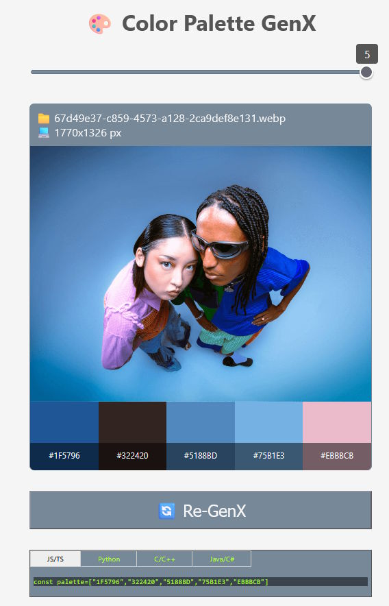

# Color Palette GenX

Questa webapp è un utility che permette la generazione di una palette di colori (da 3 a 5) da immagine.

Una volta cliccato sull'elemento canvas (segno + tratteggiato) e caricata l'immagine, saranno generati i colori in esadecimale (tipo: #FF00FF)
che potranno essere copiati negli appunti cliccandoci sopra.

Inoltre la palette dei colori sarà salvata in una variabile di tipo array disponibile per i vari linguaggi di programmazione, questo per facilitare l'esportazione della palette.

Cliccando sul codice generato per il  relativo linguaggio, questo verrà copiato negli appunti (clipboard).

